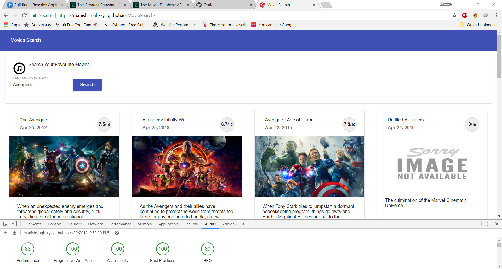
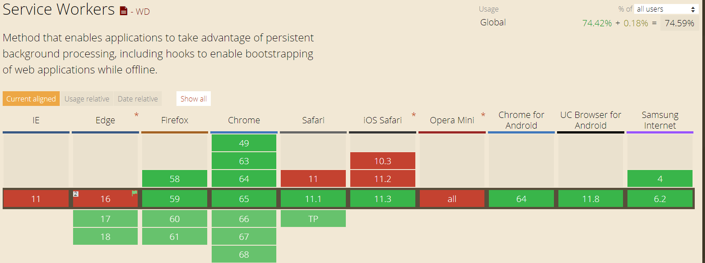

# PWAs using Angular 5

This is a sample for building an progressive web app based on the design principles of Angular 5 which has inbuilt support of Service workers.

# Why PWA ?

* A progressive web app (PWA) delivers an app-like experience through your mobile phone’s browser but has the same flexibility and gestures as a native application. Because they are powered by mobile browsers, they are not particular to any one device, meaning developers no longer need to write separate code for Android and Apple devices.

<p align="center">
    
</p>

# Demo
  * https://manishsingh-xyz.github.io/MovieSearch/
 

# How to run on local machine

* This project is based on the Angular 5 so you need to install latest angular CLI.

## Using `npm`

Check out and build the [PWAs-Using-Angular5](https://github.com/ERS-HCL/pwas-using-angular5.git)
```bash
git clone https://github.com/ERS-HCL/pwas-using-angular5.git
cd pwas-using-angular5
npm install
```


```bash
# Run project on local server
ng serve  //Open http://localhost:4200/
```

Now, once you update your library source code it will automatically be re-compiled and your project will be re-built so you may see library changes instantly.

# Final Production Build

* Create a new repository on github.com 
* Go to the terminal and run the following:

```bash 
git add .
git commit -m "Upload project to github"
git remote add origin git@github.com:{username}/{repo name}.git
git push --set-upstream origin master
```

* Build a production version of application
* After build, we can see a new ‘/dist’ folder with our bundled app.
```
ng build --prod --base-href "/{Repo name}/"
```

#Limitation

* As of now PWA is supported by all the modern browsers.
* Below is the list for all the supported browsers:

<p align="center">
    
</p>

# License
 [MIT](/LICENSE)

